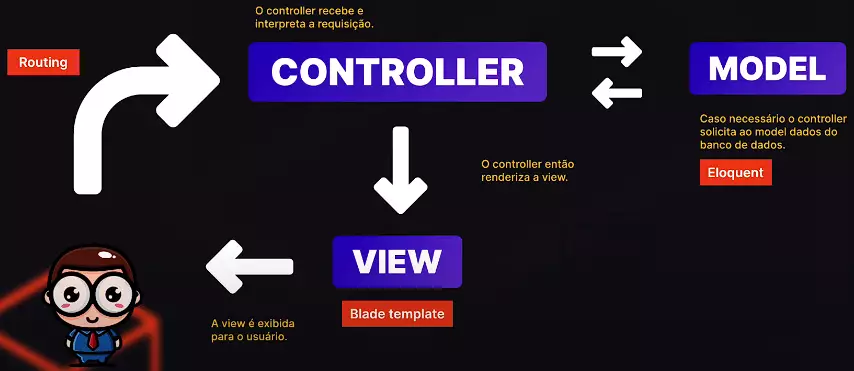

# Curso gratuito laravel -laravue

## MVC
- M -> Model (É responsável pela comunicação com o banco de dados)
- V -> View (É responsável por mostrar as páginas pro usuário)
- C -> Controller (É responsável pela comunicação entre model e view e toda a lógica das regras de negócio do sistema)

## Funcionamento do Laravel
- 

- Tudo no laravel começa pela parte de **routing**. Porque é a partir de uma rota que puxamos um controller e o controller aplica a lógica criada, podendo puxar dados do banco de dados através do model e renderizar uma página a partir de uma view. De uma forma geral, esse é o **fluxo de dados** do laravel

## Comandos artisan
- `php artisan` - lista os comandos existentes no artisan

- `php artisan route:list` - lista as rotas do sistema

- `php artisan migrate` - sobre as migrations e cria as tabelas no banco de dados

- `php artisan migrate --seed` - roda todas as seeds e popula o banco de dados

- `php artisan make:controller nomeController` - cria um controller

## Programando com laravel
- O ponto de partida do laravel são as rotas, então, devemos começar toda a escrita do código criando uma rota no arquivo de rotas. O arquivo de rotas para web é o **routes/web.php**

- Nas rotas, podemos passar parâmetros que serão injetados dentro do callback
    - `Route::get('/users/{paramA}/{paramB}', function($paramA, $paramB){})`

- Contudo, esses parâmetros são obrigatórios e a omissão de um deles irá resultar num erro e no travamento do sistema. Mas existe uma forma de contornar isso, quando não sabemos se será passado ou não um parâmetro pra a rota, podemos usar parâmetros opcionais
    - A sintaxe para um parâmetro opcional é o uso do **?** logo após o parâmetro e no callback devemos passar um **valor default**, que na maioria dos casos é usado o **null**
    - `Route::get('/users/{paramA?}/{paramB?}', function($paramA = null, $paramB = null){})`

- Temos a possibilidade de usar grupos de rotas, para os casos onde temos atributos compartilhados entre elas, como middleware, prefixos, controllers e outros, assim não precisamos declará-los individualmente
    - A sintaxe para criar um grupo de rota depende do grupo, mas em linhas gerais segue o mesmo padrão, o que muda é o nome do grupo
    - Nesse exemplo, temos um grupo de rotas que compartilham o mesmo prefixo **admin** 
    -   ```
        Route::prefix('admin')->group(function () {
            Route::get('/', function(){
                return "/admin";
            });
            Route::get('/{id}', function ($id) {
                return "/admin/{$id}";
            });
            Route::get('/{id}/tags', function($id){
                return "admin/{$id}/tags";
            });
        });
        ```

- Podemos adicionar **nomes** as rotas. Esses nomes se tornam interessantes na **montagem de links**. A partir do momento que montamos um link com o nome da rota e não a sua uri, caso essa uri venha mudar, o link não será quebrado, pois esta sendo feito a partir do nome da rota. Logo, o uso de nome nas rotas torna a manutenção e alteração do código mais fácil
    - A sintaxe para atribuir um nome para uma rota é usando o método **name()** 
    - `Route::get('/users/list', function(){})->name('users.list');`

### Model binding
- No laravel, temos um recurso chamado **model binding** que faz a associação entre o parâmetro da rota e um model automaticamente

- Para isso, o parâmetro da rota deve ser obrigatoriamente um id e devemos fazer a injeção do model na rota ou controller. Assim, quando acessamos a rota e passamos o parâmetro, o laravel já faz automaticamente a busca e retorna o modelo correspondente ao identificador (parâmetro) fornecido

- Sintaxe
    - Nesse caso, ao passarmos um valor para o parâmetro da rota, o laravel já vai fazer a busca do modelo no banco de dados correspondente a esse parâmetro e injetara os resultado dentro da rota
    - Por exemplo, se passarmos 1 como parâmetro, o laravel vai retornar os dados do usuário com id 1
    -   ```
        //O parâmetro da rota deve ter o mesmo nome que o parâmetro passado no callback ou controller
        Route::get('user/{user}', function(User $user){
            return $user;
        });
        ```

- Contudo, o model binding por padrão associa o parâmetro passado ao id do registro, mas se quisermos procurar por outra coluna e não o id. Para isso podemos usar **:** na frente do parâmetro seguido pelo **nome da coluna**
    - Agora, a pesquisa no banco de dados será feita na coluna name e não id
    -   ```
        Route::get('user/{user:name}', function(User $user){
            return $user;
        });
        ```

### Camada de Request
- No Laravel, o "Request" é uma classe que representa e encapsula os dados da solicitação HTTP recebida pelo servidor. Essa classe fornece uma interface conveniente para acessar os parâmetros, cabeçalhos, cookies, arquivos enviados e outras informações relacionadas à solicitação.

- Quando uma rota é acionada no Laravel, você pode acessar o objeto "Request" no controlador ou no método de rota correspondente. O Laravel instancia automaticamente o objeto "Request" e o injeta como um parâmetro no método onde ele é necessário.

- Sintaxe
    - Nesse exemplo, está sendo retornado o método http da requisição
    -   ```
        Route::get('/request', function(Request $request){
            dd($request->getMethod());
            return 'x';
        });
        ```

### Controller
- No Laravel, um "controller" é uma classe responsável por tratar as requisições HTTP e coordenar a lógica de negócio de um conjunto de rotas. Ele implementa as ações que processam as requisições, acessam modelos e retornam respostas apropriadas. Os controllers ajudam a manter o código organizado, separando a lógica das rotas e facilitando a reutilização. Eles são parte importante da arquitetura MVC adotada pelo Laravel.

- Para ligar um controller com uma rota devemos alterar a estrutura da rota. Ao invés de passarmos um callback logo após a uri, agora passaremos um array tendo seu primeiro elemento, a classe do controller e o segundo, um método do controller que será executado quando acessarmos essa rota

- Sintaxe
    - Nesse exemplo, quando acessarmos a rota **/users**, ela irá chamar o controller **UserController** e executará o método **index** existente dentro desse controller
    -   ```
        Route::controller(UserController::class)->group(function(){
            Route::get('/users', 'index')->name('users.index');
            Route::get('/users/{user}', 'show')->name('users.show');
        });
        ```

### Views - Blade Templates
- A camada de **view** do laravel é responsável por gerar as páginas que serão mostradas pro usuário

- Os arquivos de views ficam dentro da pasta **resources/views**

- Para podermos usar a engenharia do blade template, precisamos criar os arquivos de view com a extensão **.blade.php**. Se criarmos apenas com **.php**, vai funcionar, mas não podermos usar todas as vantagens do blade template, como seus helpers

- Para renderizarmos uma **view**, devemos usar o método **view()** com o nome da view sem a extensão. Caso a view esteja dentro de um subdiretorio, podemos usar a notação de . para navegarmos até a view
    -   ```
        //A view está na raiz da pasta /views
        public function index(){
            return view('index');
        }

        //A view esta dentro de views/users/show.blade.php
        public function show(User $user){
            return view('users.show', compact('user'));
        }
        ```

## Injetando Assets
- O laravel nos disponibiliza a diretiva **asset()** que resolve o caminho dos assets até a pasta public, ou seja, quando usamos essa diretiva, já temos o caminho criado até **url/public/**

- Contudo, caso tenhamos esses **assets em uma cdn**, por exemplo, podemos usar a diretiva **assets** da mesma forma, a única mudança, é que **devemos adicionar uma variável de ambiente no arquivo .env** chamada **APP_URL** com a url da cdn, assim, a diretiva asset passará a usar essa nova url como caminho.

- Caso queiramos **usar arquivos css/js específicos em algumas páginas**, mas que **não precisem serem carregados em todas as outras**, o laravel nos disponibiliza a diretiva **stack()**. **Essa diretiva serve para empilhar os arquivos**. Então, no layout base, devemos usar essa diretiva. Já na página que vamos usar os arquivos css/js, devemos usar a diretiva **push()** para puxar os arquivos da diretiva stack. Lembrando que ambos devem ter o mesmo nome

- Mas esses arquivos serão inseridos na ordem que forem chamados, mas podemos usar a diretiva **prepend()** para jogarmos um arquivo para o topo da pilha. Essa diretiva substitui o push